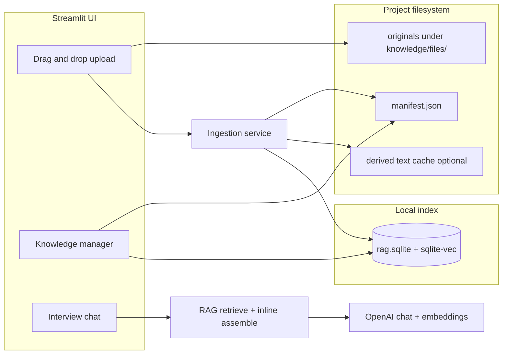

# Implementation Plan: Project Knowledge (Uploads + sqlite-vec RAG)

This document describes how to add **drag-and-drop document uploads**, **git-friendly storage** under `.specify/orchestrator/knowledge/`, and **local RAG** using **SQLite + sqlite-vec**, while keeping the **chat transcript the primary driver** and uploaded material **reference-only**.

## Goals

1. SMEs can attach project artifacts (PDF, DOCX, Markdown, plain text, etc.) for the AI interviewer to cite and ask about.
2. **Original files** are stored under the project at `.specify/orchestrator/knowledge/` so they can be **committed and versioned** with the repo.
3. **First pass includes RAG** (sqlite-vec), with a clear rule for when chunks are **retrieved** vs when a small doc is **inlined into context**.
4. **Parameter extraction** (`conduct_interview_step` completion path and `extract_parameters_from_transcript`) receives the same reference context as the interview, with explicit instructions that **only user-confirmed or chat-stated facts** are authoritative for Spec Kit output (see [AI interview doc](ai-interview-and-parameter-extraction.md)).
5. Documents are **project-scoped** and persist across interview sessions and future features; **per-session** controls choose which docs are active and optional “focus” text.

Non-goals for this pass: multi-user server sync, OCR for scanned PDFs (optional later), automatic secret redaction in uploads (document as a follow-up risk).

---

## Architecture Overview



---

## Directory and File Layout

Under each Spec Kit **project root** (same parent as `.specify/orchestrator/interview_state.json`):

| Path | Purpose | Version in git |
|------|---------|----------------|
| `.specify/orchestrator/knowledge/files/{doc_id}/` | Original upload (preserved name or sanitized basename + stored metadata) | **Yes** (user request) |
| `.specify/orchestrator/knowledge/manifest.json` | Document registry (ids, modes, tags, paths, hashes, status) | **Yes** |
| `.specify/orchestrator/knowledge/parsed/{doc_id}.txt` | Normalized extracted text (optional cache for debugging and re-chunk without re-parsing) | **Recommend yes** for reproducibility; can be gitignored if size is a concern |
| `.specify/orchestrator/knowledge/rag.sqlite` | Chunk text metadata + sqlite-vec embedding table | **Recommend gitignore** (rebuildable; avoids large binary diffs). Document rebuild in README |

**Rationale for gitignoring `rag.sqlite`:** Embeddings are deterministic given the same model and chunking; clones can **re-index** from `files/` + `manifest.json`. Originals remain the audited source of truth. If the team prefers a fully portable checkout with no re-index step, they can commit `rag.sqlite`—call this out as a configurable convention.

---

## Document Registry (`manifest.json`)

Single JSON file (schema versioned) listing each document:

- `id`: UUID or ulid string (stable across renames of display title).
- `original_filename`, `stored_relpath`: path under `knowledge/files/`.
- `mime_type`, `byte_size`, `sha256` of original file (for change detection).
- `ingestion_status`: `pending` | `parsed` | `indexed` | `failed` (with `error_message`).
- `ingestion_mode`: **`inline_eligible`** | **`rag_only`** (see below).
- `user_override_mode`: optional `null` | `force_inline` | `force_rag` to pin behavior.
- `tags`: optional list of strings for future filtering.
- `created_at`, `updated_at` (ISO 8601 UTC).
- `chunking`: `{ "strategy": "recursive", "chunk_size": ..., "overlap": ... }` for reproducibility.

**Change detection:** On upload or file replace, if `sha256` differs, mark stale, delete old chunks for `doc_id` from SQLite, re-parse and re-embed.

---

## Ingestion Modes: Conditional Inline vs RAG

**Definitions:**

- **Inline (native context):** A bounded block of text is injected into the model messages (system or a dedicated “Reference excerpts” user message) for that turn.
- **RAG:** Query the sqlite-vec index with the **current user message** (and optionally last assistant question) to fetch top-k chunks; inject those chunks as labeled citations.

**Default decision logic (automatic, overridable in UI):**

| Condition | Default mode |
|-----------|----------------|
| Extracted plain text ≤ **N characters** (e.g. 8k–12k; tune after testing with `gpt-4o` context budget) | Prefer **inline**: store full text in manifest flag `inline_eligible`; still **chunk and index** for consistency and for extraction-time retrieval if inline must be truncated. |
| Extracted text > **N** | **`rag_only`** for the bulk of content; optional **summary** (single cheap LLM call or extractive summary) stored for a short inline “abstract” if desired (post-v1 optional). |
| User sets **“Always retrieve (RAG)”** | `user_override_mode: force_rag` — never inline full doc; only snippets from retrieval. |
| User sets **“Always include in context”** | `user_override_mode: force_inline` — if over budget, show warning and either refuse or truncate with explicit notice. |

**Per-turn behavior:**

1. Collect **active document IDs** for this interview session (from `interview_state` or session state; see below).
2. For each active doc with `force_inline` or inline-eligible small doc: add **full text** (or capped prefix) to a **single** reference section (dedupe).
3. Run **one** RAG query over the union of chunks belonging to active docs (filter `doc_id IN (...)`), with k tuned (e.g. 5–10 chunks).
4. Assemble **one** supplemental message:  
   `### Retrieved reference (not agreed with the user; confirm in chat)`  
   plus numbered snippets with `[doc_id / filename / chunk_index]`.

**System prompt additions:** Instruct the model to treat reference text as **unverified** until the SME confirms in the chat, and to ask clarifying questions when sources conflict with the user.

---

## sqlite-vec RAG Store

**Database:** `rag.sqlite` using Python `sqlite3` with the **sqlite-vec** extension loaded.

**Tables (conceptual):**

- `chunks`: `chunk_id`, `doc_id`, `chunk_index`, `text`, `token_count` (optional), `created_at`
- `embeddings`: sqlite-vec virtual table mapping `chunk_id` → vector (dimension matches embedding model)
- Optional `embedding_model` row in a `meta` table for invalidation when the model changes

**Embeddings:** Use OpenAI **text-embedding-3-small** (or **large** if quality insufficient) for consistency with existing `OPENAI_API_KEY` usage. Store model name and dimension in `meta`.

**Query flow:**

1. Embed the query string (user’s latest message; optionally concatenate short tail of history).
2. `SELECT chunk_id, text, distance ... ORDER BY distance LIMIT k` with `doc_id` filter.
3. Return snippets for injection.

**Operational note:** sqlite-vec requires a **loadable extension** available on the runtime OS. The plan should include:

- Dependency: verify [sqlite-vec](https://github.com/asg017/sqlite-vec) distribution for Linux/macOS/Windows (PyPI package or bundled `.so` / `.dylib` / `.dll`).
- CI: install extension or skip integration tests with a marker when extension missing.
- Fallback (optional): if extension load fails, log error and use **brute-force cosine** over a small in-memory batch for tiny projects only—not for production scale; better to **fail closed** with a clear UI message to install sqlite-vec.

---

## Text Extraction

| Format | Library / approach |
|--------|-------------------|
| `.md`, `.txt`, `.csv` (optional) | Read as UTF-8 with replacement on errors |
| `.pdf` | `pypdf` or `pymupdf` (faster/denser layout); start with one |
| `.docx` | `python-docx` |

Reject or quarantine unknown MIME types. Enforce **max file size** (config constant, e.g. 10–25 MB) and **max total project knowledge size** to protect disk and index time.

---

## Interview Session Integration

### Extend `interview_state.json` (schema bump)

Add fields (backward compatible for older files):

- `knowledge_schema_version`
- `active_document_ids`: list of doc ids included in this session
- `session_focus`: optional short string (“Current feature: checkout”; free text)

On **Resume**, restore `active_document_ids` and focus from disk.

### `AIInterviewService` changes

- Add an optional parameter to `conduct_interview_step` and `extract_parameters_from_transcript` / `_generate_parameters`, e.g. `reference_context: Optional[str]` or structured `ReferenceBundle` (inline block + retrieved snippets).
- Build that bundle **in the page layer or a thin `knowledge_context.py` helper** so the service stays testable.
- Append reference content as **separate message(s)** after system prompt and before history (or immediately before the latest user turn), matching your existing list-of-messages pattern.

**Extraction:** When running `_generate_parameters`, pass the **same** retrieval + inline assembly (using full transcript or last N turns as query) so phase documents benefit from docs **without** treating them as overriding the transcript (align with existing extraction rules in `ai_interview.py`).

---

## Streamlit UI

### Interview page (`interview_chat.py`)

- **Expander or sidebar block:** “Project knowledge”
  - `st.file_uploader(..., accept_multiple_files=True)` (Streamlit supports drag-and-drop onto the widget).
  - On upload: run ingestion (spinner), refresh manifest.
  - Multiselect: **active documents** for this session (default: all indexed docs active, or last-used from state).
  - Per-doc or global override: **Auto / Prefer inline / RAG only** radio.
  - Link or button: “Manage knowledge” → navigate to dedicated page if implemented.

### Optional dedicated page: `pages/knowledge.py` (recommended)

- Table of documents: name, size, status, mode, tags, uploaded date.
- Actions: delete (remove file + manifest entry + chunks), reindex, download, replace.
- **Reindex all** button for fresh clones without `rag.sqlite`.

Register the page in `app.py` navigation.

---

## New Modules (suggested layout)

```
src/orchestrator/services/
  knowledge_manifest.py      # load/save manifest, CRUD doc records
  knowledge_ingest.py        # parse, chunk, embed, write sqlite
  knowledge_rag.py           # retrieve top-k, build reference string
  knowledge_paths.py         # resolve paths under project .specify/orchestrator/knowledge
```

Keep **no secrets** in manifest; originals may contain sensitive data—warn in UI (same as committing any doc).

---

## Security and Robustness

- Resolve all paths under `project_path / ".specify" / "orchestrator" / "knowledge"`; never use raw user strings as path components (use `doc_id` directories).
- Sanitize display names; prevent `..` in stored filenames.
- Enforce workspace **`base_directory`** validation for `project_path` (existing pattern) before any write.
- Rate-limit embedding calls during bulk upload (simple queue or batch API if available).

---

## Configuration

Optional keys in orchestrator `config.yml` (future) or constants in code for v1:

- `knowledge_max_file_bytes`, `knowledge_max_total_bytes`
- `knowledge_inline_char_threshold`
- `knowledge_chunk_size`, `knowledge_chunk_overlap`
- `knowledge_retrieval_top_k`
- `knowledge_embedding_model`

---

## Testing

- **Unit:** chunking, manifest round-trip, mode resolution (inline vs RAG), path containment.
- **Integration:** ingest a tiny `.txt` and `.pdf` fixture, assert rows in SQLite and retrieval returns expected chunk; mark tests `requires_sqlite_vec` if needed.
- **Manual:** upload large PDF, confirm RAG path; small note, confirm inline path.

---

## Implementation Milestones

1. **Filesystem + manifest**  
   Create directory layout, `manifest.json` schema, CRUD, Streamlit upload → save original → manifest entry → `pending`.

2. **Parsing + chunking**  
   Extract text, write optional `parsed/{doc_id}.txt`, compute `sha256`, status transitions.

3. **sqlite-vec + embeddings**  
   Initialize DB, embed chunks, store vectors, implement retrieval with doc filter.

4. **Mode logic**  
   Implement auto inline vs RAG + user overrides; build reference bundle.

5. **Interview wiring**  
   Session active docs, extend `interview_state`, pass reference bundle into `AIInterviewService` for interview and extraction.

6. **Knowledge management page**  
   List/delete/reindex; document `rag.sqlite` rebuild in README.

7. **Docs + polish**  
   User-facing help: chat is authoritative, how to commit knowledge, how to reindex after clone.

---

## README / User Documentation Updates (when implementing)

- Where files land, that **`rag.sqlite` is local and optionally gitignored**, and how to **Reindex**.
- That large repos should prefer **RAG mode** and **active doc** subset to reduce noise.
- Privacy reminder: uploaded content may be sent to OpenAI for **chat and embeddings** per existing API usage.

---

## Open Questions (resolve during implementation)

- Exact **inline threshold** and **top-k** after measuring token usage with your default model.
- Whether to add a **one-click “use only docs tagged X”** filter (manifest already supports tags).
- Whether **parameter document generation** should log which `doc_id` chunks influenced output (auditability vs verbosity).

This plan aligns with the orchestrator’s **filesystem source of truth**, **interview_state persistence**, and existing **OpenAI** usage while making **sqlite-vec RAG** a first-class part of the first release of the feature.
